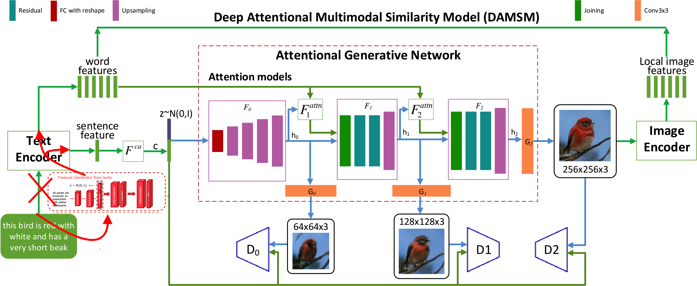

# Hybrid Attention GAN

My model based on two papers:

[AttnGAN: Fine-Grained Text to Image Generation with Attentional Generative Adversarial Networks](http://openaccess.thecvf.com/content_cvpr_2018/papers/Xu_AttnGAN_Fine-Grained_Text_CVPR_2018_paper.pdf)
[A Generative Adversarial Approach for Zero-Shot Learning from Noisy Texts](http://openaccess.thecvf.com/content_cvpr_2018/papers/Zhu_A_Generative_Adversarial_CVPR_2018_paper.pdf)

[AttnGAN code](https://github.com/taoxugit/AttnGAN), 
[ZSL_GAN code](https://github.com/EthanZhu90/ZSL_GAN)

The main idea is to use pretrained Encoder from the second paper during training the first one architecture.
More details you can see on the image below. 

This position is explained by the fact that ZSL GAN takes as input noisy text descriptions about an unseen class (e.g.Wikipedia articles) and can generates synthesized visual features for this class. 
My position we can train ZSL GAN first and use its Embedder (_netG in code) during training AttnGAN . This will allow us generation images from noisy descriptions. 
To make it better I also added DenseEncoder after output of _netG. 
